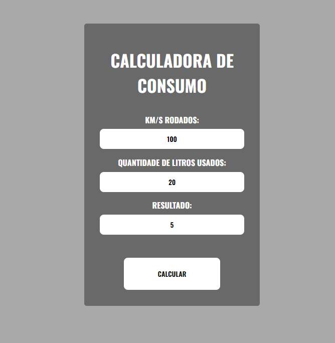

<h1 align="center"> Calculadora de consumo </h1>

Desenvolvido para calcular o consumo de combustível no seu veiculo.

  <a href="#-tecnologias">Tecnologias</a>&nbsp;&nbsp;&nbsp;|&nbsp;&nbsp;&nbsp;
  <a href="#-projeto">Projeto</a>&nbsp;&nbsp;&nbsp;|&nbsp;&nbsp;&nbsp;
  <a href="#-Deploy">Deploy</a>&nbsp;&nbsp;&nbsp;|&nbsp;&nbsp;&nbsp;
  <a href="#memo-licença">Licença</a>&nbsp;&nbsp;&nbsp;|&nbsp;&nbsp;&nbsp;
  <a href="#-developed-by-bruno-catan-">Contato</a>&nbsp;&nbsp;&nbsp;

  

 

  

## 🚀 Tecnologias

Esse projeto foi desenvolvido com as seguintes tecnologias:

-   Vite
-   React
-   Module.css
-   Typescript

## 💻 Projeto

Projeto desenvolvido para facilitar a vida de quem não sabe como calcular o consumo de combustível do seu veiculo.

## 👨🏻‍💻 Deploy

<a target="_blank" href="https://calculadora-de-consumo.vercel.app/">CLICK PARA ACESSAR!</a>

## :memo: Licença

Esse projeto está sob a licença MIT.

---

  <h3> Developed by <a href="https://www.linkedin.com/in/brunocatan/">Bruno Catan</a> ☕</h3>
  
  
  

